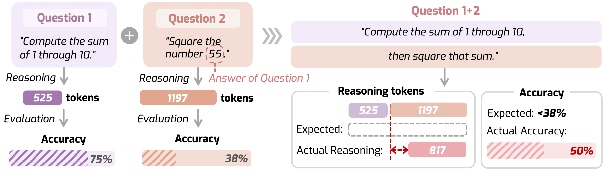
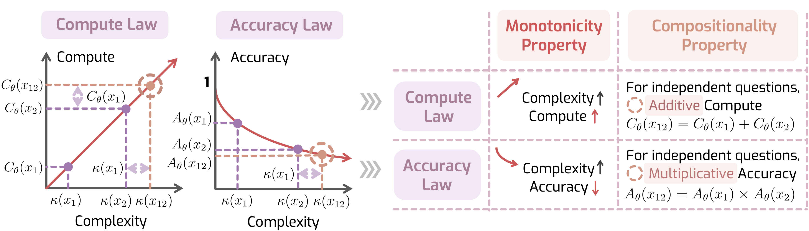

<h1 align="center"><strong>When Reasoning Meets Its Laws</strong></h1>
  

    <a href='https://jyzhang1208.github.io/' target='_blank'>Junyu Zhang </a>∗&emsp;
    <a href='https://runpeidong.web.illinois.edu/' target='_blank'>Yifan Sun </a>∗&emsp;
    <a href='https://rookiehb.github.io/' target='_blank'>Tianang Leng </a>∗&emsp;
    <a href='https://scholar.google.com/citations?user=-tpUy14AAAAJ&hl=en' target='_blank'>Jingyan Shen </a>∗&emsp;
     
    <a href='https://geng-haoran.github.io/' target='_blank'>Liu Ziyin </a>&#8224&emsp;
    <a href='https://xialin-he.github.io/' target='_blank'>Paul Pu Liang </a>&#8224&emsp;
    <a href='https://www.huan-zhang.com/' target='_blank'>Huan Zhang </a>&#8224&emsp;
     
     University of Illinois Urbana-Champaign 
    &emsp;&emsp; Massachusetts Institute of Technology
     
    &emsp;&emsp; University of Pennsylvania
    &emsp;&emsp; New York University
    &emsp;&emsp; NTT Research
     
    ∗ Equal contribution&emsp;&#8224; Equal mentorship
     
  

  
  
  
  

## 🏠 About

    

Despite the superior performance of Large Reasoning Models (LRMs), their reasoning behaviors are often counterintuitive, leading to suboptimal reasoning capabilities.

    

We present the Laws of Reasoning (LoRe), a unified framework that characterizes intrinsic reasoning patterns in LRMs. LoRe introduces the *compute law* with the supplementary *accuracy law*, examined through two properties: *monotonicity* and *compositionality*. LoRe-Bench, our proposed benchmark, systematically measures these two tractable properties for LRMs. To address the compositionality gap observed in existing models, we develop an effective finetuning approach that enforces compute-law compositionality.

As a comprehensive study from theoretical hypotheses to empirical validation, we advance a theoretical perspective grounded in human reasoning for improving reasoning in LRMs. We hope LoRe can inspire more potential strategies that guide models toward their optimal paradigms of thinking.

🚧 **Code release under construction — stay tuned!** 🚧

## Contact
If you have any questions related to the code or the paper, feel free to email Junyu Zhang (`junyuz6@illinois.edu`).

